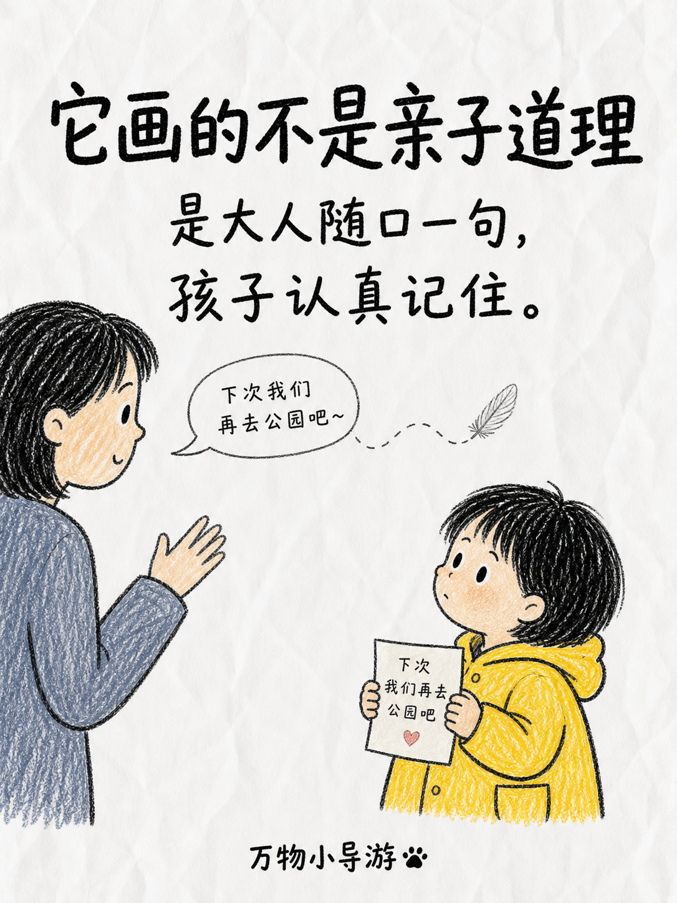

# 画风样例

每种画风一个具体示例。**风格 1** 已有成图;**风格 2–5** 暂无成图,下面给出可直接复制去生成的示例提示词——生成后把图命名为对应文件名放进本目录,README 即会显示。

---

## 1. 纯人类手绘儿童涂色页



> 输入示例:「画妈妈和孩子在门口,孩子举着一张写着"下次我们再去公园吧"的纸条」

---

## 2. 极简黑白线条漫画手稿

> 输入示例:「用极简线条画一个人深夜加班:精神满满 → 揉眼睛 → 趴在桌上睡着」
> 待生成 → 命名为 `02-minimal-line.png` 放入本目录。

```
极简主义黑白漫画手稿风格。原生、粗糙、稀疏、表现主义的速写气质,强调留白与高对比度视觉张力,带独立图画小说的艺术实验感。
构图:多格漫画页面排版,用带圆角的手绘不规则边框把画面分割成不同面板(Panel);竖版,面板自上而下堆叠。
空间:极其平面化的二维视角,不追求透视准确,通过线条疏密和剪影暗示空间关系,大量负空间(Negative Space)构成画面主体。
线条:极具手感和偶然性的线条,线条不闭合,边缘粗糙。
质感:高对比度,无中间调。
色彩:单色系统。背景为米白/灰白纸张基调,前景为灰黑色。
严禁任何彩色或灰阶。严禁平滑矢量线条、数字渐变或喷枪效果。避免精确几何形状、直线尺规作图痕迹,以及写实风格的光影和细节描绘。
画面内容:一个人深夜独自加班,分镜依次为:坐姿端正、精神满满地打字;揉眼睛、开始疲惫;最后趴在桌上睡着,台灯还亮着。
```

---

## 3. 蜡笔童涂(5岁小孩坏画)

> 输入示例:「用蜡笔童涂画一只恐龙在吃生日蛋糕」
> 待生成 → 命名为 `03-crayon.png` 放入本目录。

```
A drawing made by a real 5-year-old child with crayons on white paper.
NOT made by an artist. It should look clumsy, messy, and "bad" on purpose.

Subject: a green dinosaur eating a birthday cake.

MANDATORY childlike flaws (do not clean these up):
- shaky wobbly outlines that wander, overshoot corners, and never close neatly
- often double-drawn lines where the kid went over the same edge twice
- proportions clumsy and wrong; arms and legs are thin crooked stick-lines with no volume
- face uneven and asymmetric: eyes different sizes and not level, crooked smile, features off-center
- coloring is messy and goes OUTSIDE the outlines; large patches of white paper left unfilled; scribble strokes in random directions
- bright flat primary crayon colors (green, and red, yellow, green, purple, black), no shading, no gradient, no blending
- hand-lettered title "HAPPY BIRTHDAY" at the top in uneven wobbly capital letters, each a different color, on a crooked baseline, letters different sizes

Flat naïve composition, objects floating with no perspective, plain white background.
Look genuinely crude — avoid anything cute, polished, symmetric, balanced, or professional.
```

---

## 4. 吉卜力风

> 输入示例:「用吉卜力风画夏日午后,一个女孩坐在开满野花的山坡上看云」
> 待生成 → 命名为 `04-ghibli.png` 放入本目录。

```
Studio Ghibli style hand-drawn anime illustration of a girl sitting on a wildflower-covered hillside on a summer afternoon, gazing up at the clouds.
Soft hand-painted watercolor aesthetic with gentle cel-shaded coloring; warm cinematic lighting with sunlight softly diffusing from above and a tender glow.
Bright yet harmonious, lightly saturated color palette; lush, detailed natural environments and dreamy, nostalgic atmosphere.
Expressive Ghibli-inspired character features, gentle emotional tone, whimsical and heartwarming mood.
Soft shading and atmospheric depth, clean delicate linework, painterly hand-drawn feel — not 3D, not photoreal, not a digital vector look.
```

---

## 5. 小豆人黑色涂鸦信息图

> 输入示例:「用小豆人风画"如何冲一杯手冲咖啡"的步骤图」
> 待生成 → 命名为 `05-bean-doodle.png` 放入本目录。

```
A hand-drawn black marker doodle explainer illustration on off-white paper,
vertical infographic with 4 stacked panels separated by thin hand-drawn lines.

Character: a simple solid-black round blob person with two white dot eyes,
a small curved smile, and thin black stick arms and legs. The body is solid
flat black with smooth edges (no sketchy texture). The SAME character appears
in every panel doing a different action.

Style: clean black marker/pen outlines, slightly wobbly but fully closed
hand-drawn lines. All objects are OUTLINE-ONLY black line-art with white
interiors, no shading, no fill. Everything is monochrome black & white EXCEPT
one orange accent color used ONLY for the single key item in each panel.
Hand-drawn curved arrows in red or blue point at key spots, each with a short
handwritten Chinese label. Each panel has a bold hand-written marker-style
Chinese title at the top. Minimalist composition, lots of white space.

Panels:
1. 「磨豆」the bean person grinds coffee beans in a hand grinder — orange accent on the beans, label 中度研磨
2. 「润湿滤纸」pours hot water to rinse the paper filter in a dripper — orange accent on the dripper, label 先冲掉纸味
3. 「闷蒸」slowly pours a little water over the grounds, steam rising — orange accent on the kettle, label 闷蒸30秒
4. 「分段注水」pours in circles to finish brewing into a cup — orange accent on the coffee cup, label 画圈注水
```
