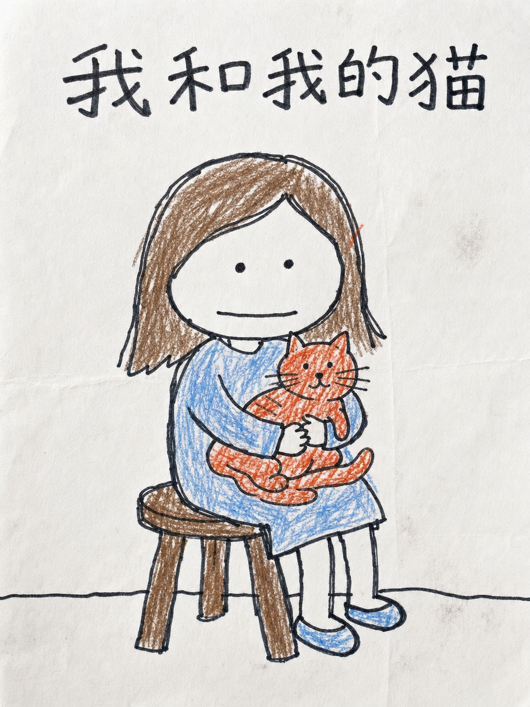
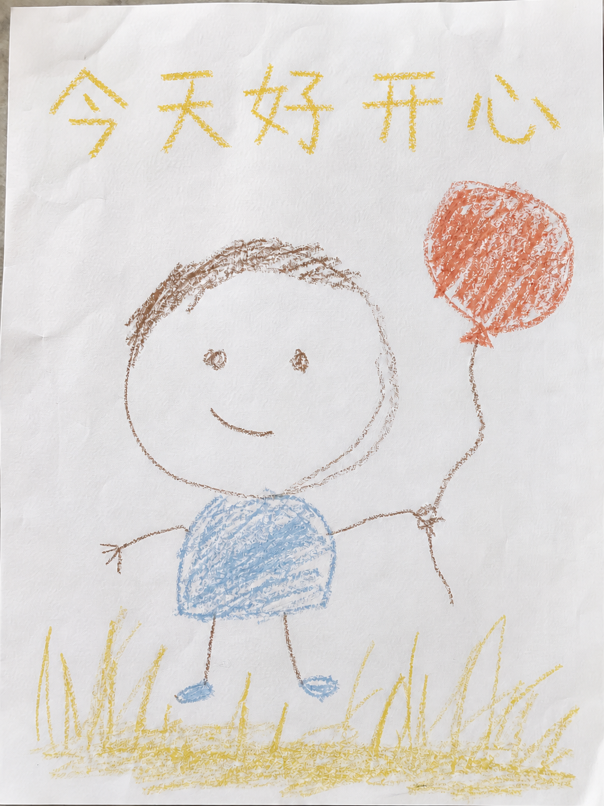
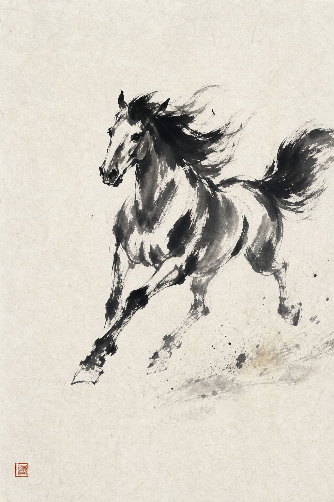
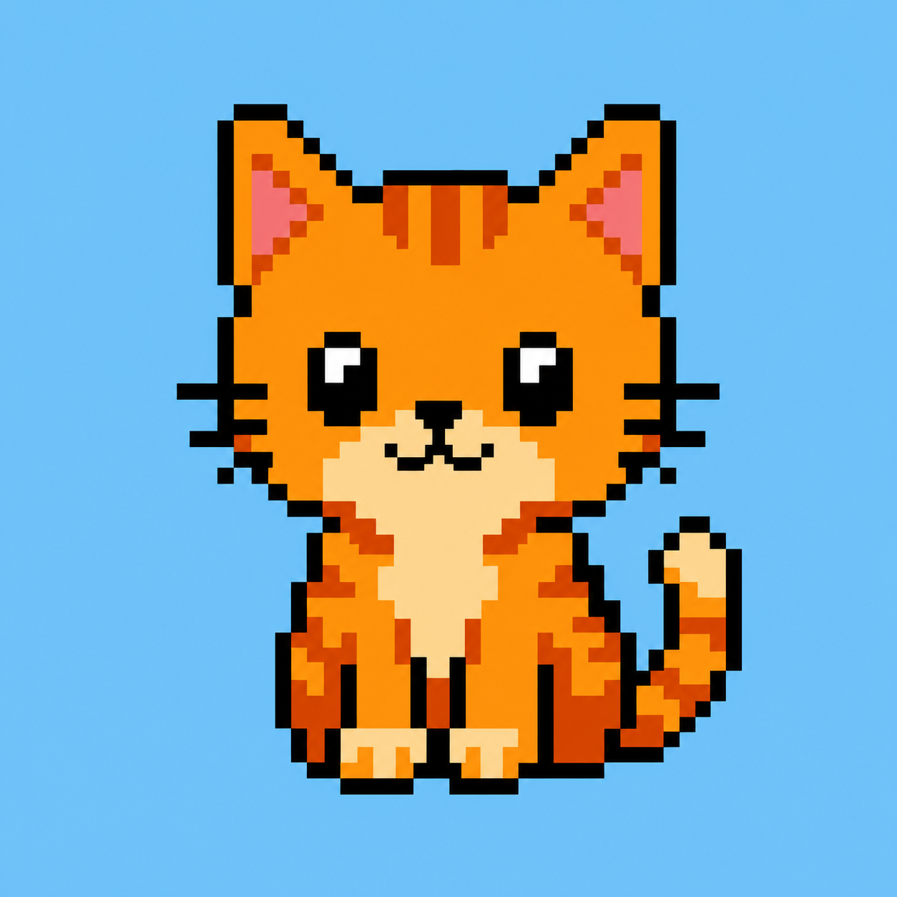
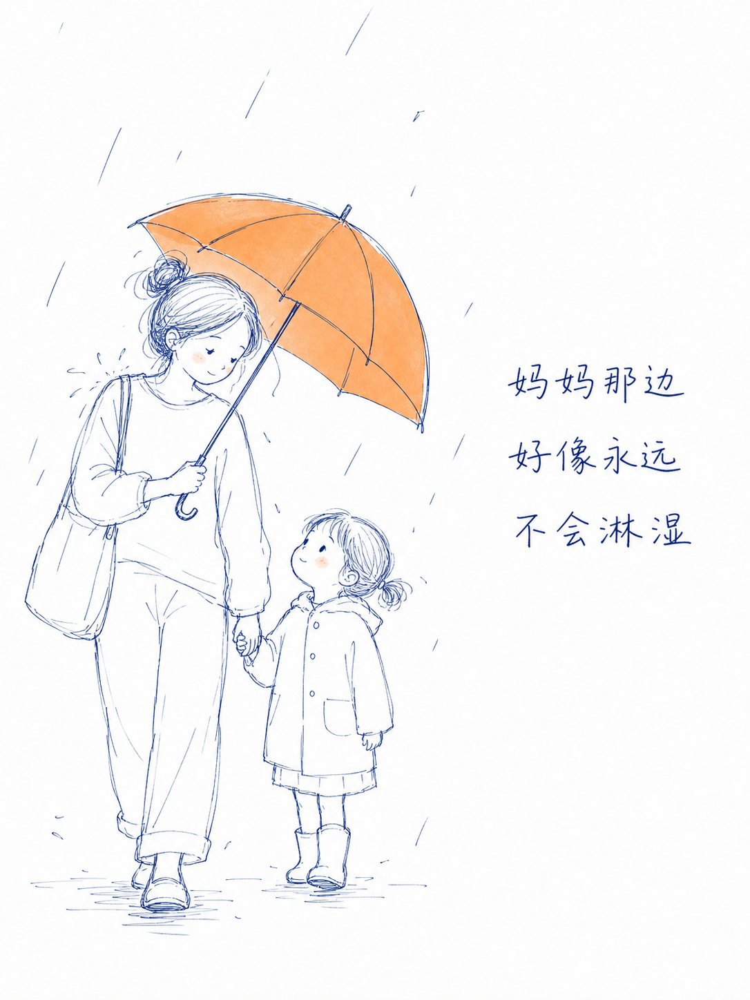
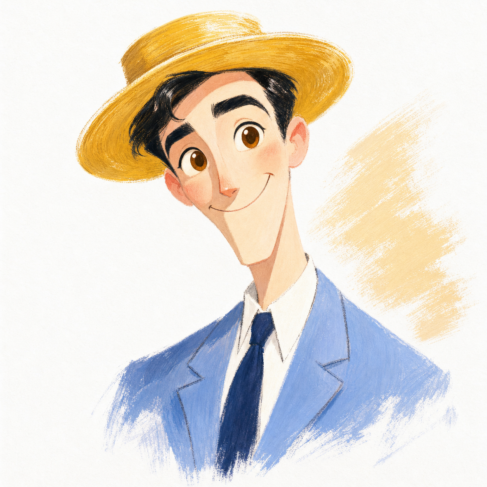
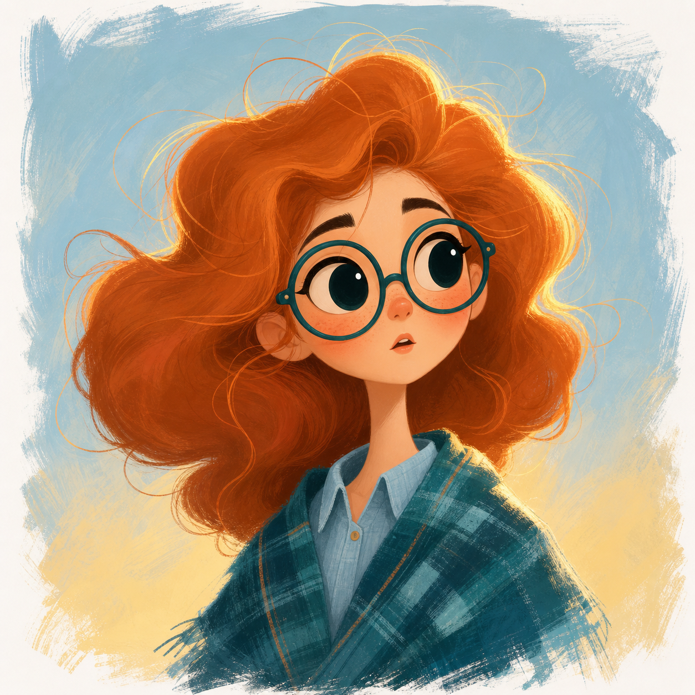
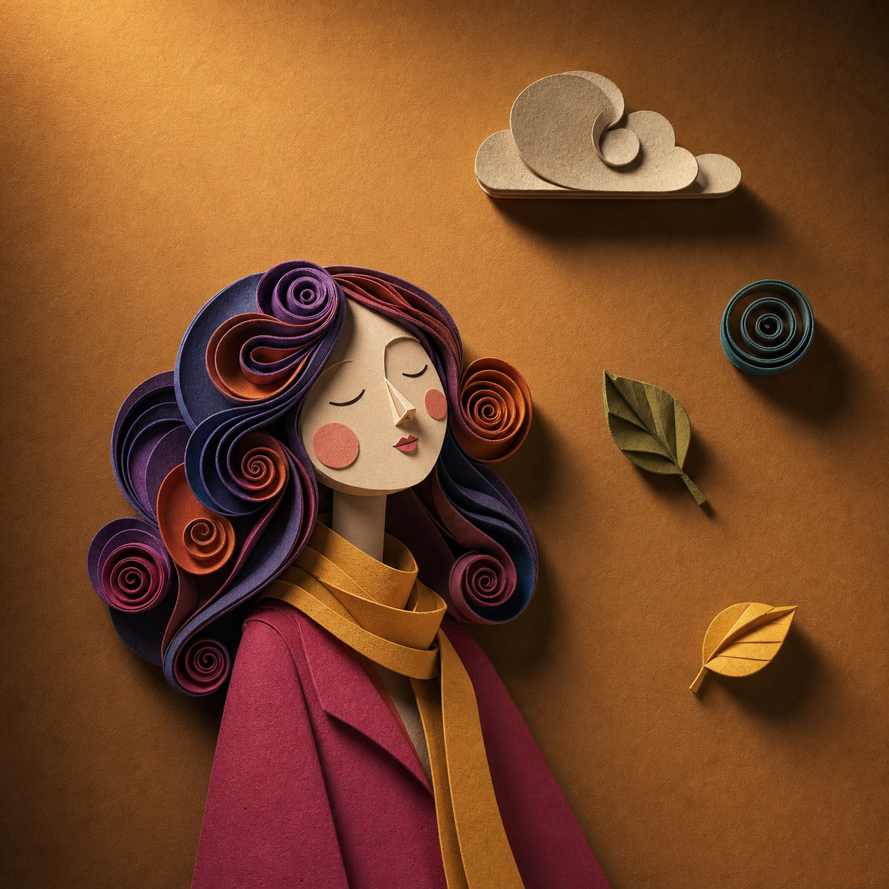

# 画风样例

每种画风一个具体示例:**样图 + 可直接复制的输入示例提示词**。下列 14 种画风 + 2 变体(共 16 段)配方均已用真实出图验证通过。

> 注:样图文件由维护者陆续落盘;若某张暂未显示,说明图片文件还在补传中,提示词本身已验证可用。

---

## 1. 纯人类手绘儿童涂色页


> 输入示例:「画妈妈和孩子在门口,孩子举着一张写着"下次我们再去公园吧"的纸条」

---

## 1.1 儿童涂色页-低饱和克制版



> 输入示例:「用低饱和克制版画一个小女孩坐板凳上抱着橘猫,顶部标题 我和我的猫」
> 样图为叠加 STYLES.md「附录 A·实拍纸质感增强层」后的效果(2026-07-13 更新);示例提示词已含该层。
> 和 #1 的区别:极简留白背景 + 低饱和 ≤4 色 + 全画只一处橙红(橘猫)。命门是别让模型画精致——线要糙抖、脸要笨、色要露白越界。

```
白纸上的纯人类手绘儿童涂色画,不是数字插画、不是插画师作品、不是商业绘本。画面结构是"普通大人徒手画的粗黑涂色线稿 + 5-8 岁儿童自己填色"。
主体:一个小女孩坐在小板凳上,怀里抱着一只橘猫。
线稿(最重要):粗黑马克笔外轮廓,是普通大人徒手画的、不是插画师——线条粗细明显不匀、明显抖动歪扭、好几处描了两三遍留下重复线、拐角接不齐有豁口或出头;圆形、板凳腿、桌边都不许画标准,透视可以是错的,主体可以偏离中心。内部细线越少越好,绝不允许细密漂亮稳定的线稿。
脸/造型:人物比例儿童画式简化——头略大、手脚简单;五官简单甚至有点笨,眼睛就是小圆点、嘴一条线,不要大眼睛萌脸、不要卡通可爱、不要商业绘本脸;头发、衣褶不许画精细。
填色(最重要):彩笔/蜡笔儿童式乱涂——每个主要色块都留下大片没涂到的白(约 25%–35% 露白)、深浅明显不匀、有断续笔画和乱方向;必须有 2–3 处颜色明显涂到黑线外面(越界约 1–5mm),且出现在头发、衣服、猫身这种一眼看得见的地方,不是只在边缘做毛刺。
背景:极简,只有一条歪歪的地面线加极少线索,不要完整装修、不要家具堆叠、不要漂亮细节。
纸面:亮白真实纸,少量不规律褶皱、压痕与纸纤维感,大量留白,不要满屏纸纹滤镜。
配色(严格):低到中饱和,像蜡笔轻涂;全页有彩色不超过 4 种,不要艳丽纯色、不要多色平均用力;主要用雾蓝(女孩衣服)、暖棕木色(板凳/头发)这类压住的低饱和色;强调色只有一个=橙红,只用在那只橘猫身上作为情绪焦点,别处不再出现橙红。
严禁:平滑稳定等粗的数字线稿、完美圆、完美透视、完美对称、商业绘本精致可爱人物、渐变、阴影建模、3D、体积光、颜色平滑均匀填满、均匀蜡笔噪点滤镜、背景装修完整。整体像普通人随手画在纸上的投稿,笨拙、不完美、有明显手误,不是 AI 手绘滤镜。
【材质增强层·最重要】整张图必须像"用手机在明亮柔和日光下拍摄的、画在真实纸上的画作照片",不是数字图:
- 纸面有微距可见的纸纹颗粒(纸的凹凸牙口),纸有轻微起伏和一两道很淡的折痕;
- 颜料有真实材料感:蜡笔/彩笔重压处颜料结块、有轻微蜡质反光,轻扫处颜料只挂在纸纹凸起上、露出大量纸白点;马克笔线有渗墨感,起笔收笔略粗;
- 每个色块内部深浅明显不均,能看清一笔一笔的运笔方向、起笔收笔和折返;
- 笔画边缘因纸面凹凸而毛糙断续,不是干净的边;
- 纸上有极少量真实使用痕迹:一两处轻微蹭脏或指蹭痕;
- 光照:明亮均匀,白纸干净发亮,只有极淡的纸面起伏阴影,无暗角。
严禁:均匀的数字噪点滤镜、平滑均匀填色、干净矢量线、任何数字插画感。
文字:画面顶部写手写中文标题,逐字为 我和我的猫,像儿童绘本手写字,笔画粗圆钝、轻重不均、结构宽松,但必须准确可读,不要乱码错字伪文字。
```

---

## 2. 极简黑白线条讲解漫画(xkcd 火柴人)


> 输入示例:「用极简线条讲解番茄工作法」

```
xkcd 风格的极简黑白火柴人讲解漫画,画在米白/奶油色纸上。
【最重要·硬性负向约束】严禁实心黑色填充、严禁剪影、严禁排线与阴影、严禁明暗与体积感、严禁厚涂或氛围渲染。人物与物体一律只用细线描边。
角色:简单火柴人——圆圈头 + 极简点线五官,身体四肢是细单线;用小道具(番茄钟、书、水杯)表示身份,不画细节。
线条:细、均匀、略带手抖的黑色钢笔线,纯轮廓线稿,平面二维,无透视。
版式:4 格面板组成网格,每格用手绘略歪的圆角矩形框住,面板之间大量留白。
色彩:纯黑白单色,黑线 + 米白纸,无任何其它颜色,无灰阶。
文字:每格顶部加粗手写中文小标题,下方一句手写中文说明;可加简短对话气泡。中文清楚可读,不得错字、乱码或伪中文。
分镜:
1. 「设定任务」火柴人坐桌前在清单上写一件事 —— 只挑一件,专注它
2. 「专注25分钟」火柴人盯着番茄钟工作,旁标 25:00 —— 中途不被打扰
3. 「短休5分钟」火柴人起身伸懒腰喝水 —— 让大脑歇口气
4. 「四轮后长休」四个小番茄排成一行,火柴人躺平 —— 每4轮休长一点
```

---

## 3. 蜡笔童涂(5岁小孩坏画)


> 输入示例:「用蜡笔童涂画 OCEAN 主题:小孩戴泳镜潜水、一头大鲸鱼、几条小鱼」

```
A drawing made by a real 5-year-old child with crayons on white paper.
NOT made by an artist. It should look clumsy, messy, and "bad" on purpose.

Subject: an ocean scene — a kid in a snorkel mask diving, a big whale, and a few small fish.

MANDATORY childlike flaws (do not clean these up):
- shaky wobbly outlines that wander, overshoot corners, and never close neatly
- often double-drawn lines where the kid went over the same edge twice
- proportions clumsy and wrong; arms and legs are thin crooked stick-lines with no volume
- face uneven and asymmetric: eyes different sizes and not level, crooked smile, features off-center
- coloring is messy and goes OUTSIDE the outlines; large patches of white paper left unfilled; scribble strokes in random directions
- bright flat primary crayon colors (blue, and red, yellow, green, purple, black), no shading, no gradient, no blending
- hand-lettered title "OCEAN" at the top in uneven wobbly capital letters, each a different color, on a crooked baseline, letters different sizes

Flat naïve composition, objects floating with no perspective, plain white background.
Look genuinely crude — avoid anything cute, polished, symmetric, balanced, or professional.
```

---

## 3.1 蜡笔童涂-潦草自画版



> 输入示例:「用潦草自画版画一个小孩牵着气球站在草地上,顶部标题 今天好开心」
> 样图为叠加 STYLES.md「附录 A·实拍纸质感增强层」后的效果(2026-07-13 更新);示例提示词已含该层。
> 和 #3 的区别:整张像 5-6 岁孩子全自己画的简笔火柴娃(大圆脸/点眼睛/叉子手)+ 低饱和 ≤4 色单橙红(气球)。

```
白纸上的一张画,整张画像一个 5-6 岁孩子完全自己画的——孩子自己起稿自己涂,不是大人画的线稿。
主体:一个小孩牵着一个气球,站在草地上。
造型:所有人物都是儿童简笔画——大圆脸、两个点当眼睛、一条线当嘴,身体是歪歪的方块或土豆形,手脚是细线条,手指画成小叉子或干脆不画;头身比例失调(头大)。物件简化成歪方块和圆圈,气球是歪圆、线是抖的。
线条:严重抖动、断线、接不上、重复描;蜡笔涂色大面积涂出边界、大量露白、有蜡笔戳点、乱向来回涂;构图偏斜,东西大小随意。
纸面:亮白真实纸,少量褶皱,大量留白。
配色(严格):低到中饱和,像蜡笔轻涂;全页有彩色不超过 4 种,不要艳丽纯色、不要多色平均用力;主要用雾蓝(小孩衣服)、芥末黄、暖棕这类低饱和色;强调色只有一个=橙红,只用在气球上作为情绪焦点,别处不再出现橙红。
严禁:精致可爱绘本脸、稳定线条、均匀涂色、正确透视、完整背景、渐变、3D、彩虹式多色。整体要像孩子自己画的画,不是插画师作品、不是 AI 手绘滤镜。
【材质增强层·最重要】整张图必须像"用手机在明亮柔和日光下拍摄的、画在真实纸上的画作照片",不是数字图:
- 纸面有微距可见的纸纹颗粒(纸的凹凸牙口),纸有轻微起伏和一两道很淡的折痕;
- 颜料有真实材料感:蜡笔/彩笔重压处颜料结块、有轻微蜡质反光,轻扫处颜料只挂在纸纹凸起上、露出大量纸白点;马克笔线有渗墨感,起笔收笔略粗;
- 每个色块内部深浅明显不均,能看清一笔一笔的运笔方向、起笔收笔和折返;
- 笔画边缘因纸面凹凸而毛糙断续,不是干净的边;
- 纸上有极少量真实使用痕迹:一两处轻微蹭脏或指蹭痕;
- 光照:明亮均匀,白纸干净发亮,只有极淡的纸面起伏阴影,无暗角。
严禁:均匀的数字噪点滤镜、平滑均匀填色、干净矢量线、任何数字插画感。
文字:画面顶部写手写中文标题,逐字为 今天好开心,像认真写字的儿童笔迹,笔画粗、歪歪扭扭、大小不一,但每个字必须准确可读,不要乱码错字伪文字。
```

---

## 4. 吉卜力风


> 输入示例:「用吉卜力风画一个女孩坐在山坡上看云」

```
Studio Ghibli style hand-drawn anime illustration of a girl sitting on a hillside gazing up at the clouds.
Clean, uncluttered composition with ONE clear focal subject; simplified background, generous calm negative space.
SKY: a smooth, even watercolor-gradient sky, calm and clean — absolutely no patchy, mottled, speckled, grainy or noisy texture.
CLOUDS: only a few large, simple, soft cumulus clouds with smooth, cohesive, rounded silhouettes — NOT many small scattered puffs, not broken, not fragmented.
Soft hand-painted watercolor look with smooth gentle gradients and soft cel-shading; warm cinematic light diffusing softly from above with a tender glow.
Bright yet harmonious, lightly saturated palette; dreamy, nostalgic, heartwarming mood.
Clean delicate linework, painterly hand-drawn feel — not 3D, not photoreal, not a digital vector, not cluttered, not fragmented.
```

---

## 5. 小豆人黑色涂鸦信息图


> 输入示例:「用小豆人风画手机省电三步:电量告急 → 关闭后台 → 续航更久」

```
A hand-drawn black marker doodle explainer illustration on off-white paper,
vertical infographic with 3 stacked panels separated by thin hand-drawn lines.

Character: a simple solid-black round blob person with two white dot eyes,
a small curved smile, and thin black stick arms and legs. The body is solid
flat black with smooth edges (no sketchy texture). The SAME character appears
in every panel doing a different action.

Style: clean black marker/pen outlines, slightly wobbly but fully closed
hand-drawn lines. All objects are OUTLINE-ONLY black line-art with white
interiors, no shading, no fill. Everything is monochrome black & white EXCEPT
one orange accent color used ONLY for the single key item in each panel.
Hand-drawn curved arrows in red or blue point at key spots, each with a short
handwritten Chinese label. Each panel has a bold hand-written marker-style
Chinese title at the top. Minimalist composition, lots of white space.

Panels:
1. 「电量告急」the bean person looks worried holding a phone with a nearly-empty battery — orange accent on the low battery bar, red arrow label 太耗电
2. 「关闭后台」the bean person swipes away floating app windows with X marks on the phone — blue arrow label 省电
3. 「续航更久」the bean person smiles holding a phone with a full battery — blue arrow label 用更久
```

---

## 6. MS Paint 烂涂鸦(the worse, the better)


> 输入示例:「用 MS Paint 烂涂鸦风画一只胖橘猫」
> 想要病毒级效果:附一张真实照片走图生图,把首句换成「把这张照片重画成…」。

```
把一只胖橘猫画成极其笨拙、潦草、可怜兮兮的烂涂鸦,像是用鼠标在 MS Paint 里一笔一笔硬画出来的。
线条歪扭、抖动、断断续续;比例荒谬地不对,该圆的不圆、该直的不直。
填色是大块粗糙的纯色,明显涂出边界、有像素锯齿、低质量数字感。
整体"明明想画对却处处不对劲",越烂越好笑;纯白背景,构图随意。
不要任何专业感、精修、写实光影、渐变或漂亮细节——刻意地丑、刻意地业余。
```

---

## 7. 圆珠笔单线涂鸦(scribble)


> 输入示例:「用圆珠笔单线涂鸦画一头狮子」

```
用单一黑色圆珠笔画的潦草涂鸦速写,描绘一头狮子。
大量快速、随性、来回缠绕的细线条,线条不闭合、带偶然性,靠线的疏密缠绕表现明暗与体积,一气呵成的速写感。
纯单色——黑色墨线 + 白纸,无平涂色块,无数字渐变。
自由、即兴、艺术化的手稿气质,而非工整插画。
```

---

## 8. 蜡笔实拍(真·儿童手涂纸张)


> 输入示例:「用蜡笔实拍画一只猫坐在花园里,有太阳、花和蝴蝶,标题 SUNNY DAY」
> 和 #3 的区别:#3 偏插画式坏画,#8 像一张真蜡笔纸的照片。
> 注:纸面奶白是"实拍照片感"的固有代价(已接受,不推纯白);本版重点是把"画得太好"压成真·幼稚——忽轻忽重没分寸、大量露白、黑色主要用于勾线。
> 样图为叠加 STYLES.md「附录 A·实拍纸质感增强层」后的效果(2026-07-13 更新);示例提示词已含该层。

```
A cellphone PHOTO of a real drawing made by a 5-year-old with wax crayons on a slightly wrinkled sheet of white printer paper. It must look photographed on real paper — visible paper texture and faint wrinkles, clean bright white paper — NOT a digital illustration.
Brightly and evenly lit, shot in soft bright daylight, well-exposed and high-key: the white paper reads clean and bright and FILLS almost the whole frame, with little or no surrounding desk or surface visible; only very soft barely-there wrinkle shadows, NO dark or moody shadows, NO underexposure, NO dim indoor lighting, NO grey or yellow cast.
Flat naive composition. Subject: a smiling cat sitting in a garden with a big sun, a few flowers and a butterfly.

Genuinely crude and childish, like a real 5-year-old who can barely draw — NOT a skilled adult imitating a child: shaky wobbly outlines that wander and don't close; clumsy wrong proportions; lumpy, barely-recognizable shapes; eyes different sizes and a crooked smile.

The CRAYON COLORING must look genuinely real (most important):
- a real kid has NO control over pressure — some strokes pressed hard and dark, others barely touch the paper, with no consistency; waxy build-up in the heavy spots that catches a slight sheen, faint streaks in the light ones, small smudges and one or two finger smears
- macro-visible paper tooth grain: crayon pigment sits only on the raised grain of the paper, strokes break up over the texture, edges rough and broken, never clean; one or two faint fold creases in the paper
- coloring is sparse and scribbly — bare white paper shows THROUGH everywhere, even inside the colored shapes (roughly 50–65% of each colored area left unfilled, white and streaky)
- black crayon is used mainly for the thin wobbly outlines rather than filling big solid areas (no big solid-black patches on the cat)
- strokes go in different directions, overlapping and broken, like a kid scribbling with no plan; color clearly overflows past the outlines in several places
- bright primary crayon colors (orange, yellow, red, blue, green, pink); absolutely NO smooth even fill, NO gradient, NO blending, NO uniform digital crayon-filter texture
- a wobbly hand-lettered title "SUNNY DAY" in uneven multicolor capital letters on a crooked baseline

Avoid anything cute, polished, symmetric or professionally illustrated. It must look like a genuine photo of a real child's messy, sparse crayon page.
```

---

## 9. 水墨写意



> 输入示例:「用水墨画一匹奔腾的骏马」

```
中国传统写意水墨画,画在生宣纸上,纯手绘毛笔笔触,不是数字插画、不是照片。
主体:一匹奔腾的骏马。
用墨:以黑墨为主,讲究"墨分五色"——焦、浓、重、淡、清并存,同一笔里有浓淡干湿变化;见飞白枯笔(干笔擦出丝丝露白)与湿墨在宣纸上自然渗化晕开(墨晕),浓淡过渡靠水分,不是均匀灰度。
笔法:写意、概括、一笔成形,寥寥数笔抓住神态,容许偶然的飞溅与断笔;不勾死板轮廓线,不填涂均匀色块。
留白:大量空白宣纸作为画面主体,疏可走马、密不透风,主体偏置一侧,构图空灵。
设色:以水墨为主,至多极少量淡赭石或花青点染;不要浓艳饱和的颜色,不要彩色铺底。
点睛:画面一角一枚小小的朱红方形印章。
纸感:能看出宣纸纤维与墨在纸上微微洇开的质感。
严禁:照片写实、3D、数字矢量、均匀灰度滤镜、平滑渐变、密集琐碎的细节、厚涂、卡通描边、艳俗配色。
```

---

## 10. 复古像素



> 输入示例:「用像素风画一只橙色的小猫」

```
复古像素风(pixel art)插画,像 8-bit / 16-bit 老游戏里的精灵图(sprite),由一颗颗清晰的方形像素手工摆出来,不是高清插画加像素滤镜。
主体:一只橙色的小猫。
像素:低分辨率观感,所有边缘都是硬朗的方块像素阶梯,像素大小一致、对齐同一网格;绝对没有抗锯齿、没有模糊、没有平滑渐变。
配色:有限调色板(retro 风,约 8–16 色,以橙色为主),色块平涂;需要明暗过渡时用"抖动(dithering)"棋盘点阵,而不是渐变。
轮廓:用清晰的深色像素描边或高对比色块区分主体;造型简洁、辨识度高,像素图标 / 游戏角色感。
背景:单一平涂纯色或极简像素背景,不喧宾夺主。
严禁:抗锯齿、柔边、模糊、平滑渐变、高清写实、3D 渲染、矢量光滑曲线、把高清图直接套像素滤镜的假像素感。
```

---

## 11. 情绪叙事淡彩速写



> 输入示例:「用情绪叙事淡彩速写画:下雨天妈妈把伞倾向女儿那边、自己肩膀淋在雨里,配文 妈妈那边 / 好像永远 / 不会淋湿」
> 命门:靛蓝松散速写线(圆形/发髻用圈状搜索线)+ 大片留白 + 全画只有一处橙色点缀(这里是伞)+ 脸颊淡腮红 + 抖动线。多人场景也要守住"只有一处橙"。中文只写短句最稳。
> 样图为叠加 STYLES.md「附录 A·实拍纸质感增强层」后的效果(2026-07-13 更新);示例提示词已含该层。

```
一张情绪叙事风格的极简淡彩速写插画,画在带细腻纸纹颗粒的白色水彩纸上(纸的牙口微距可见,笔线穿过纸纹微微断续),轻盈通透、略带稚拙的手绘感,不是数字精修插画、不是写实照片、不是水彩习作、不是日系动漫。
主体:下雨天,妈妈牵着小女儿的手走在路上,妈妈把一把伞明显倾向女儿那一边,自己半个肩膀淋在雨里。
线条(最重要):用靛蓝/藏青色钢笔画松弛速写线,线条少而肯定、清爽通透,轮廓偶尔不闭合、带轻微手抖;画头发、发髻、圆形、蓬松或环形的东西时用来回缠绕的圈状"搜索线"叠画,而不是一根干净闭合线;绝不密集排线、绝不交叉排线、绝不用线涂黑或堆阴影;雨丝用寥寥几笔斜向短线示意。
造型:真人比例与神态,大人半写实而简约、小孩圆润可爱,情绪到位、有故事感,不是Q版大头、不是写实照片、不是动漫脸;脸颊各轻点一小块淡淡腮红。
上色(最重要):整幅以大面积白纸留白为主(约六到七成纯白),绝大部分只有蓝线、不上色;只给那把伞平涂一处高饱和橙色,作为全画唯一的暖色焦点,两人衣服基本留白或极淡;水彩薄、边缘不均匀、可露白,颜料在纸纹里有细小沉淀颗粒;绝不铺满、绝不厚涂。
细节:主体旁寥寥几笔短促抖动线暗示情绪。
构图:两人偏左并靠在一起,右侧大量空白,极简。
调性:怀旧、温柔、略带心酸的家庭叙事感,画面干净轻盈。
严禁:密集排线、交叉排线、厚涂、满铺水彩、写实肖像刻画、琐碎细节、浓艳配色、多种颜色乱入、3D、照片、日系动漫脸、卡通粗描边、精细背景。
文字:画面右侧留白处写三行深蓝色手写中文,逐字为:第一行 妈妈那边 第二行 好像永远 第三行 不会淋湿。中文必须清楚可读、不得错字乱码。
```

---

## 12. 复古动画概念稿



> 输入示例:「用复古动画概念稿画:一个戴草帽的清瘦男人,蓝西装白衬衫,长脸尖下巴,亲和地笑;焦点物件=金黄色草帽」
> 命门:白纸高调(背景只有干刷扫痕,绝不满铺/绝不画光环圈)+ 奶白透粉的脸罩桃色暖光+大块 form shadow(复古海报式,不做柔和渲染)+ 少画多留(衣服大块平扫+定型线,禁细节)+ 粉彩调只留一处高饱和焦点物件。双人高浓度背景样图见 `12-retro-concept-duo.png`。
> 最常踩的坑:背景涂满变"黄底画"、肤色偏深、脸留纸白、衣服涂满加纽扣、到处高饱和。试色块/铅笔外框线不是本风格要素。

```
一张1950年代美式中古动画(mid-century Disney/UPA 血统)的角色概念画,传统水粉+彩铅在白纸上的手绘质感,不是3D渲染、不是矢量插画、不是数字厚涂、不是照片。
主体:一个戴米黄色宽檐草帽的清瘦男人,黑发从帽下露出一缕,长脸尖下巴,细长脖子,大大的棕色眼睛,穿蓝色西装外套、白衬衫和深蓝领带,咧嘴亲和地笑,头微微歪。
高调画面(最重要):整幅是明亮的高调(high-key)画面,纸底几乎就是白的——背景大面积留白露纸,只在人物一侧一小片淡金色干刷痕(方向可见、边缘毛糙),绝不均匀填色、绝不在人物四周画出一圈"光环"。
肤色与面部光(最重要):底色是极浅的奶白透粉(绝不是小麦色/古铜色),但脸绝不能留成纸白——整张脸罩一层淡淡的桃色暖光,并用干净的大块桃粉色形状阴影(form shadow)塑形:颧骨侧面、眼窝、鼻侧、下巴底、脖子下方各一块,阴影边缘略干脆像复古海报,不做柔和渐变;额头和鼻梁留最亮;鼻尖、脸颊、耳朵点粉橙腮红。
脸部造型:图形化极简——眼睛大而明亮(棕色虹膜几乎占满眼眶,上眼睑一道粗深色睫毛线,一个小圆高光),鼻子小而尖,嘴就是一条极简的曲线;眉毛粗黑有表情。
衣服(少画多留):干湿结合的水粉大块平扫——颜色饱满湿润、同一色块里有明显深浅笔触变化,但边缘毛糙露纸、局部扫白,加两三根深色定型线勾出领口翻领;下缘笔触扫散融进白纸;绝不涂满到边、绝不画纽扣缝线口袋等细节。
线条:深棕色软彩铅/炭笔线,只在头发丝、五官、领口局部收形,松而断续;没有整圈外轮廓线、没有铅笔框、没有试色块。
配色:全画低到中饱和的粉彩调——粉蓝/长春花蓝(不是深钴蓝)、奶油、杏色、暖棕;深色只出现在头发/眉毛/领带/睫毛线,做全画的明度锚点。焦点物件:金黄色草帽用高饱和暖色湿润厚涂,是全画唯一的高饱和区。
质感:干刷水粉,颜料薄、纸纹隐约透出,色块边缘毛糙露纸,像画在热压水彩纸上。
构图:方形1:1,半身,视线亲和。
严禁:满铺背景、光环圈、深肤色、体积感渲染、3D、厚涂油亮、细节堆砌、纽扣缝线、外框线、试色块、深钴蓝、日系动漫脸。
文字:不加任何文字。
```

---

## 13. 暖光童画(动画概念暖绘)



> 输入示例:「用暖光童画画一个红发蓬蓬头、戴墨绿圆框眼镜的女孩,披青绿格纹披肩,半身,惊讶地望向一侧」
> 命门:①头发写"少数大块柔软体积+轮廓飞丝",别让模型画满头细密小卷;②脸部干净柔滑、皮肤禁画布纹理(纹理只留背景和衣服);③虹膜占满眼眶只留眼角眼白;④四边露白纸边框+粉蓝奶油黄干擦背景是身份特征。换主体样图(黑发男孩抱橘猫)见 `13-sunlit-storybook-boy.png`。
> 模板为已验证英文原文,占位符也填英文,不要转译。

```
Character concept art in a modern animated-feature visual-development style, painterly digital gouache illustration.
Subject: a curious young girl with huge messy voluminous red-orange hair, wearing big round dark-teal glasses, dressed in a teal plaid shawl over a light blue shirt, waist-up portrait, slightly surprised wide-eyed expression looking off to the side.
STYLE RECIPE (follow exactly): digital gouache painting with soft clean rendering on the face (smooth soft airbrushed shading, NO canvas texture on the skin), while the background and clothing keep loose visible dry-brush strokes; background is loosely scumbled pastel sky-blue with soft cream-yellow dry-brush patches, deliberately unfinished with raw white paper showing around the border like a concept sketch; EYES: enormous round expressive eyes, the dark irises are VERY large and fill most of the eye with only small white sclera corners, one bright white highlight dot per eye, thick dark painterly upper lash line, bold expressive eyebrows; tiny pointed chin, slender neck, rosy blush cheeks, subtle freckles; HAIR: painted as a few BIG soft volumetric masses with simple smooth shading (NOT detailed ringlet curls), then a moderate number of fine individual flyaway strands drawn on top of the silhouette, warm golden rim light glowing on the hair edges; palette: complementary teal and denim blue against warm orange, soft pastel overall, gentle warm lighting, storybook charm, Pixar-Disney visual development art quality.
No text anywhere.
```

---

## 14. 北欧纸雕(paper-folk)



> 输入示例:「用北欧纸雕画一个闭眼微笑的少女,紫红渐变的衍纸卷发,玫红纸大衣配芥末黄围巾,身边飘一朵纸云、几片叶子」
> 命门:① NOT flat papercut 必须写——不写就出平面对称剪纸花边;②留白+不对称 editorial 构图写死,否则画面被填满变装饰壁纸;③立体感三件套=部件物理垫高+大而柔的真实投影+左上柔光,丢一样就"变平";④脸=闭眼细弧线+圆形腮红贴片+凸起三角纸鼻,眼睛一睁开就串味。全身叙事场景样图(纸偶乐手与民俗鸟)见 `14-paper-folk-musician.png`。
> 模板为已验证英文原文,占位符也填英文,不要转译。出身:Midjourney --sref 1399033614 的 gpt-image 复刻。

```
A sculptural 3D paper-craft diorama artwork, rendered like a soft 3D render of a handcrafted layered paper sculpture, NOT flat papercut, NOT symmetrical ornament.
Subject: a serene young woman with closed eyes and voluminous hair built from thick curved paper ribbons and large rolled quilling spirals in muted purple, indigo, magenta and orange, wearing a magenta-pink paper coat with a mustard yellow scarf, centered, waist-up, against a large plain textured warm ochre-brown cardstock backdrop with generous empty negative space around the subject.
CHARACTER RECIPE (for any figure): gently three-dimensional sculpted paper face with smooth rounded cheeks, soft rosy blush circles, a small protruding geometric triangular paper nose casting a tiny shadow, closed eyes drawn as thin calm curved lines, tiny serene lips; hair and clothing built from thick curved paper ribbons, rolled quilling spirals, pleated paper fans and layered scalloped paper feathers like overlapping bird plumage; some pieces carry embossed damask folk patterns.
FOLK ELEMENTS: a few Scandinavian folk-art paper pieces placed beside the subject — one stylized folk cloud, a few stylized leaves and one rolled paper spiral — sparse, asymmetric editorial composition with lots of breathing room.
MATERIAL: every piece is matte felt-like cardstock with visible embossed fiber texture and fine swirling filigree embossing, slightly curled edges.
DEPTH & LIGHT (most important): strong sculptural depth — elements physically raised several millimeters off the background, casting large soft realistic drop shadows onto the wall and onto each other; soft warm studio lighting from upper left, gentle dark vignette at the edges.
PALETTE: muted jewel tones — mustard yellow, ochre, coral orange, magenta pink, lilac purple, slate blue, teal — on a warm earthy backdrop.
Warm handcrafted editorial illustration mood. No text.
```
