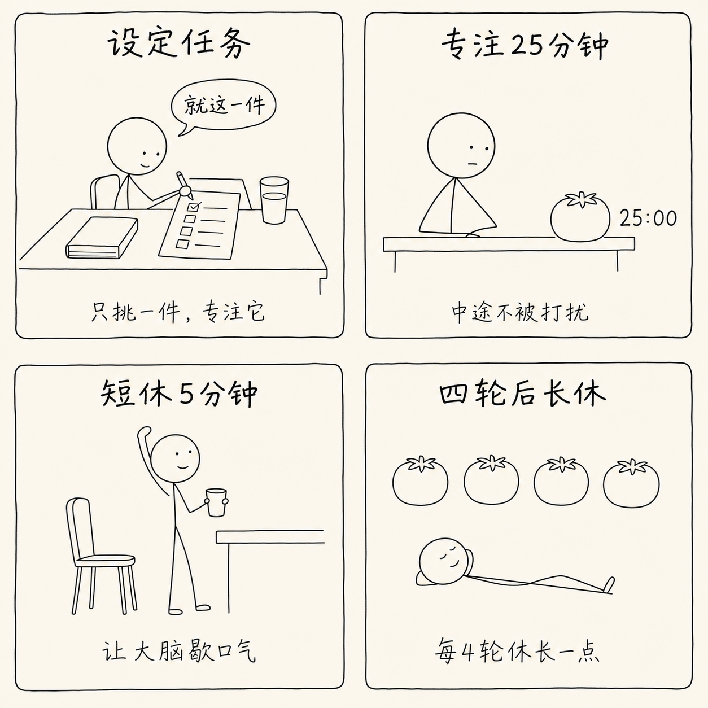
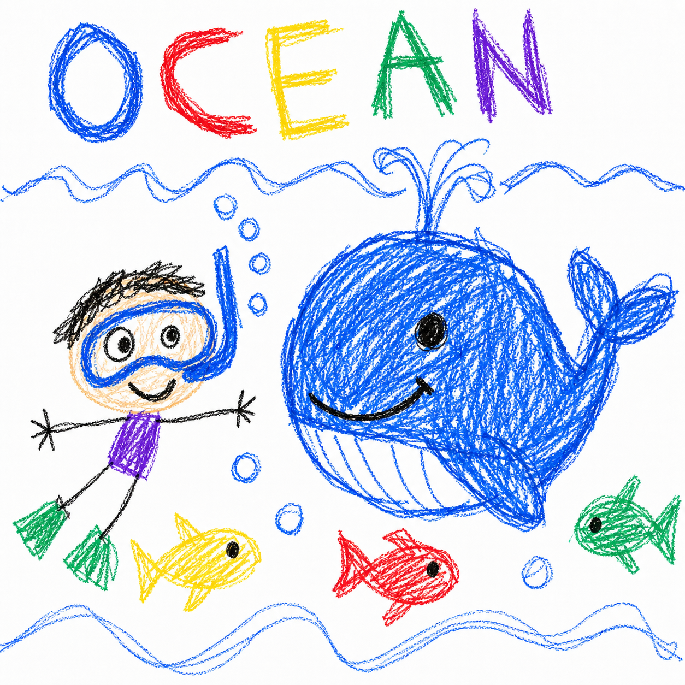
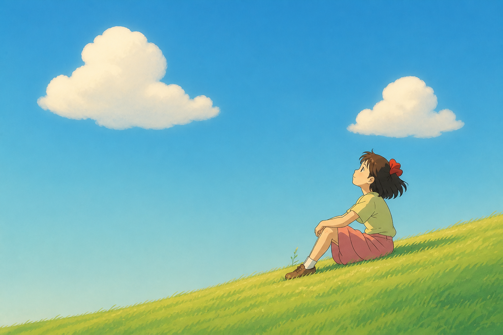
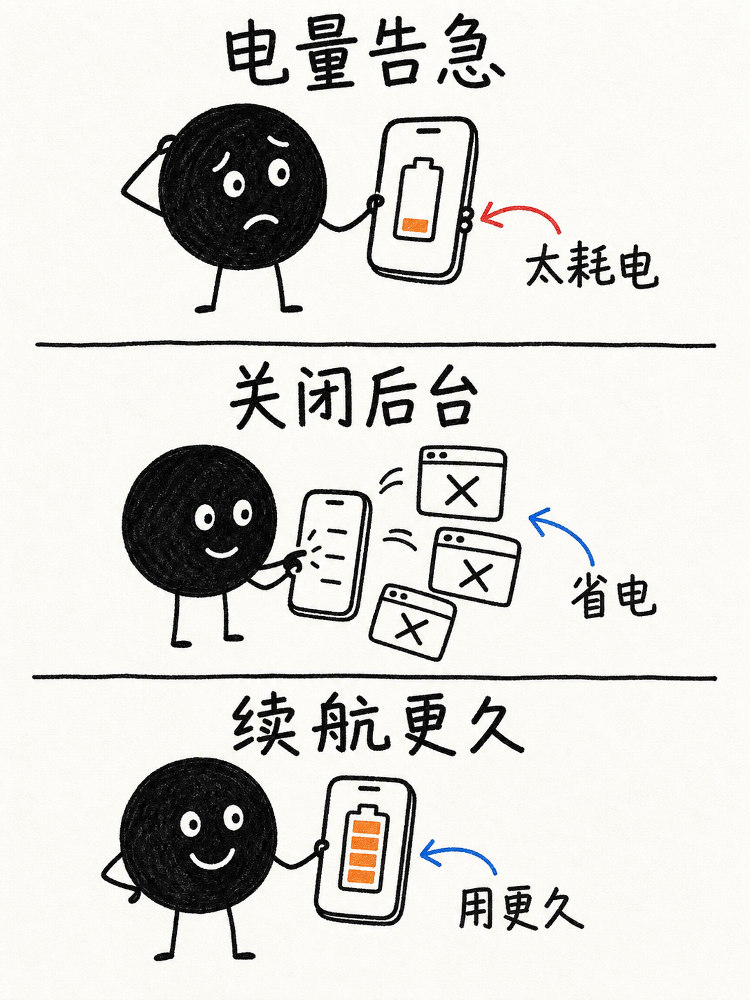
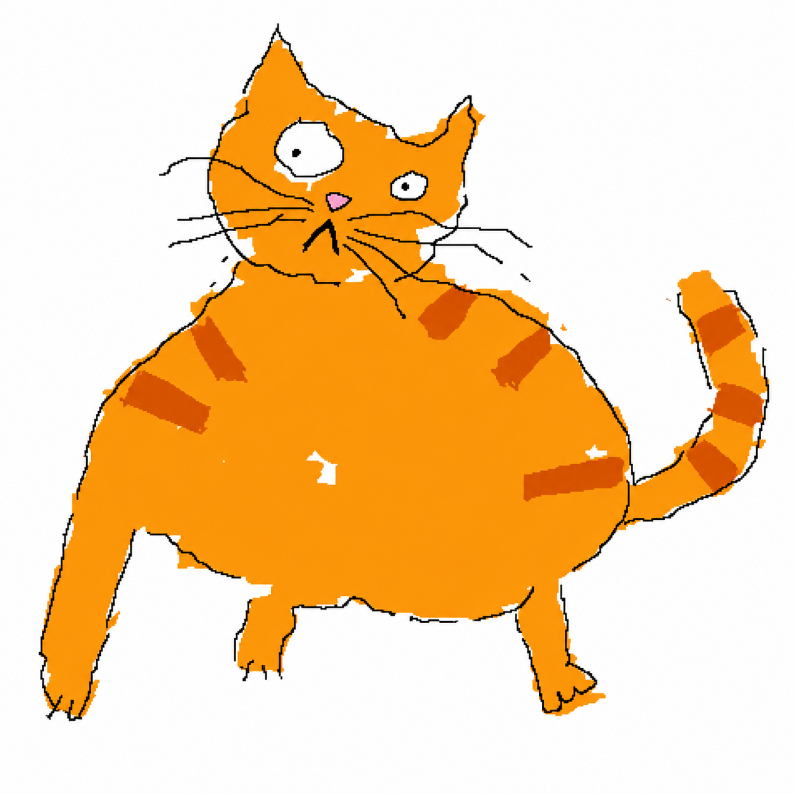
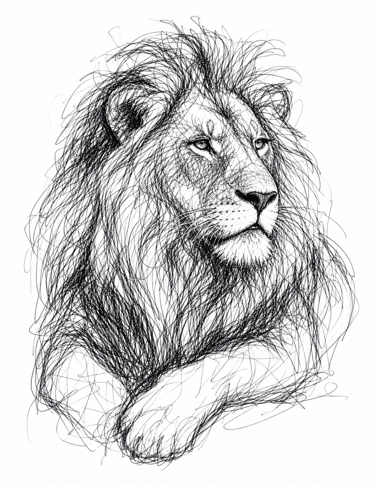
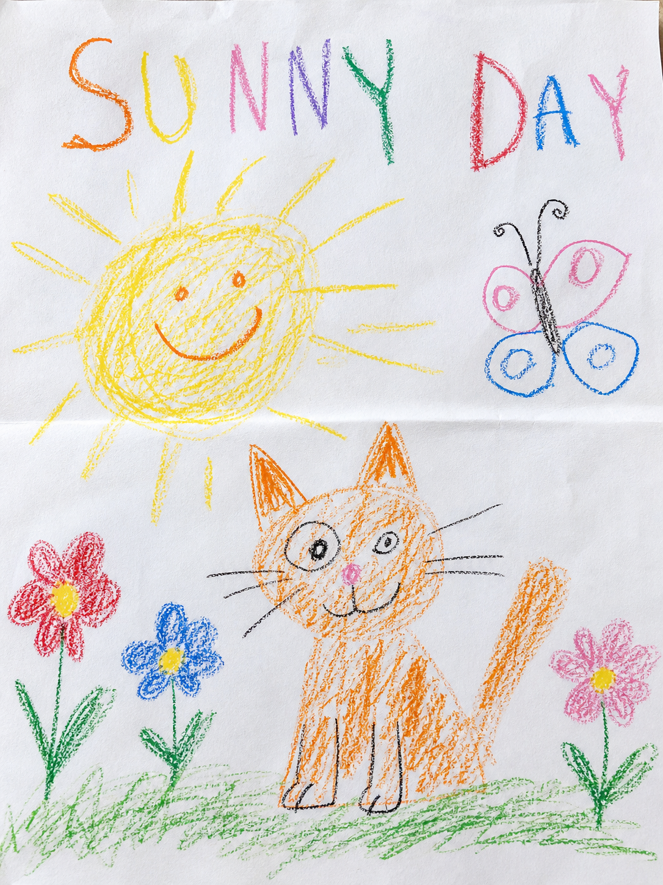

# 画风样例

每种画风一个具体示例:**样图 + 可直接复制的输入示例提示词**。下列 8 段配方均已用真实出图验证通过。

> 注:样图文件由维护者陆续落盘;若某张暂未显示,说明图片文件还在补传中,提示词本身已验证可用。

---

## 1. 纯人类手绘儿童涂色页


> 输入示例:「画妈妈和孩子在门口,孩子举着一张写着"下次我们再去公园吧"的纸条」

---

## 2. 极简黑白线条讲解漫画(xkcd 火柴人)



> 输入示例:「用极简线条讲解番茄工作法」

```
xkcd 风格的极简黑白火柴人讲解漫画,画在米白/奶油色纸上。
【最重要·硬性负向约束】严禁实心黑色填充、严禁剪影、严禁排线与阴影、严禁明暗与体积感、严禁厚涂或氛围渲染。人物与物体一律只用细线描边。
角色:简单火柴人——圆圈头 + 极简点线五官,身体四肢是细单线;用小道具(番茄钟、书、水杯)表示身份,不画细节。
线条:细、均匀、略带手抖的黑色钢笔线,纯轮廓线稿,平面二维,无透视。
版式:4 格面板组成网格,每格用手绘略歪的圆角矩形框住,面板之间大量留白。
色彩:纯黑白单色,黑线 + 米白纸,无任何其它颜色,无灰阶。
文字:每格顶部加粗手写中文小标题,下方一句手写中文说明;可加简短对话气泡。中文清楚可读,不得错字、乱码或伪中文。
分镜:
1. 「设定任务」火柴人坐桌前在清单上写一件事 —— 只挑一件,专注它
2. 「专注25分钟」火柴人盯着番茄钟工作,旁标 25:00 —— 中途不被打扰
3. 「短休5分钟」火柴人起身伸懒腰喝水 —— 让大脑歇口气
4. 「四轮后长休」四个小番茄排成一行,火柴人躺平 —— 每4轮休长一点
```

---

## 3. 蜡笔童涂(5岁小孩坏画)



> 输入示例:「用蜡笔童涂画 OCEAN 主题:小孩戴泳镜潜水、一头大鲸鱼、几条小鱼」

```
A drawing made by a real 5-year-old child with crayons on white paper.
NOT made by an artist. It should look clumsy, messy, and "bad" on purpose.

Subject: an ocean scene — a kid in a snorkel mask diving, a big whale, and a few small fish.

MANDATORY childlike flaws (do not clean these up):
- shaky wobbly outlines that wander, overshoot corners, and never close neatly
- often double-drawn lines where the kid went over the same edge twice
- proportions clumsy and wrong; arms and legs are thin crooked stick-lines with no volume
- face uneven and asymmetric: eyes different sizes and not level, crooked smile, features off-center
- coloring is messy and goes OUTSIDE the outlines; large patches of white paper left unfilled; scribble strokes in random directions
- bright flat primary crayon colors (blue, and red, yellow, green, purple, black), no shading, no gradient, no blending
- hand-lettered title "OCEAN" at the top in uneven wobbly capital letters, each a different color, on a crooked baseline, letters different sizes

Flat naïve composition, objects floating with no perspective, plain white background.
Look genuinely crude — avoid anything cute, polished, symmetric, balanced, or professional.
```

---

## 4. 吉卜力风



> 输入示例:「用吉卜力风画一个女孩坐在山坡上看云」

```
Studio Ghibli style hand-drawn anime illustration of a girl sitting on a hillside gazing up at the clouds.
Clean, uncluttered composition with ONE clear focal subject; simplified background, generous calm negative space.
SKY: a smooth, even watercolor-gradient sky, calm and clean — absolutely no patchy, mottled, speckled, grainy or noisy texture.
CLOUDS: only a few large, simple, soft cumulus clouds with smooth, cohesive, rounded silhouettes — NOT many small scattered puffs, not broken, not fragmented.
Soft hand-painted watercolor look with smooth gentle gradients and soft cel-shading; warm cinematic light diffusing softly from above with a tender glow.
Bright yet harmonious, lightly saturated palette; dreamy, nostalgic, heartwarming mood.
Clean delicate linework, painterly hand-drawn feel — not 3D, not photoreal, not a digital vector, not cluttered, not fragmented.
```

---

## 5. 小豆人黑色涂鸦信息图



> 输入示例:「用小豆人风画手机省电三步:电量告急 → 关闭后台 → 续航更久」

```
A hand-drawn black marker doodle explainer illustration on off-white paper,
vertical infographic with 3 stacked panels separated by thin hand-drawn lines.

Character: a simple solid-black round blob person with two white dot eyes,
a small curved smile, and thin black stick arms and legs. The body is solid
flat black with smooth edges (no sketchy texture). The SAME character appears
in every panel doing a different action.

Style: clean black marker/pen outlines, slightly wobbly but fully closed
hand-drawn lines. All objects are OUTLINE-ONLY black line-art with white
interiors, no shading, no fill. Everything is monochrome black & white EXCEPT
one orange accent color used ONLY for the single key item in each panel.
Hand-drawn curved arrows in red or blue point at key spots, each with a short
handwritten Chinese label. Each panel has a bold hand-written marker-style
Chinese title at the top. Minimalist composition, lots of white space.

Panels:
1. 「电量告急」the bean person looks worried holding a phone with a nearly-empty battery — orange accent on the low battery bar, red arrow label 太耗电
2. 「关闭后台」the bean person swipes away floating app windows with X marks on the phone — blue arrow label 省电
3. 「续航更久」the bean person smiles holding a phone with a full battery — blue arrow label 用更久
```

---

## 6. MS Paint 烂涂鸦(the worse, the better)



> 输入示例:「用 MS Paint 烂涂鸦风画一只胖橘猫」
> 想要病毒级效果:附一张真实照片走图生图,把首句换成「把这张照片重画成…」。

```
把一只胖橘猫画成极其笨拙、潦草、可怜兮兮的烂涂鸦,像是用鼠标在 MS Paint 里一笔一笔硬画出来的。
线条歪扭、抖动、断断续续;比例荒谬地不对,该圆的不圆、该直的不直。
填色是大块粗糙的纯色,明显涂出边界、有像素锯齿、低质量数字感。
整体"明明想画对却处处不对劲",越烂越好笑;纯白背景,构图随意。
不要任何专业感、精修、写实光影、渐变或漂亮细节——刻意地丑、刻意地业余。
```

---

## 7. 圆珠笔单线涂鸦(scribble)



> 输入示例:「用圆珠笔单线涂鸦画一头狮子」

```
用单一黑色圆珠笔画的潦草涂鸦速写,描绘一头狮子。
大量快速、随性、来回缠绕的细线条,线条不闭合、带偶然性,靠线的疏密缠绕表现明暗与体积,一气呵成的速写感。
纯单色——黑色墨线 + 白纸,无平涂色块,无数字渐变。
自由、即兴、艺术化的手稿气质,而非工整插画。
```

---

## 8. 蜡笔实拍(真·儿童手涂纸张)



> 输入示例:「用蜡笔实拍画一座房子、一棵树、一个太阳,标题 MY HOUSE」
> 和 #3 的区别:#3 偏插画式坏画,#8 像一张真蜡笔纸的照片。

```
A cellphone PHOTO of a real drawing made by a 5-year-old with wax crayons on a slightly wrinkled sheet of white printer paper. It must look photographed on real paper — visible paper texture, faint shadows and wrinkles, off-white tone — NOT a digital illustration.
Flat naive composition. Subject: a house with a tree and a sun.

Clumsy and "bad" on purpose: shaky wobbly hand-drawn outlines that wander and don't close; wrong proportions; uneven shapes.

The CRAYON COLORING must look genuinely real (most important):
- real waxy crayon texture with visible directional strokes; heavy pressure marks in some spots and barely-there light strokes in others; waxy build-up and smudges
- coverage is INCOMPLETE — large areas of bare white paper show THROUGH even inside the colored shapes (roughly 40–50% of each colored area left unfilled and streaky)
- strokes go in different directions, overlapping and broken, like a kid scribbling with no plan
- color clearly overflows past the outlines in several places
- bright primary crayon colors; absolutely NO smooth even fill, NO gradient, NO blending, NO uniform digital crayon-filter texture
- a wobbly hand-lettered title "MY HOUSE" in uneven multicolor capital letters on a crooked baseline

Avoid anything cute, polished, symmetric or professionally illustrated. It must look like a genuine photo of a real child's messy crayon page.
```
