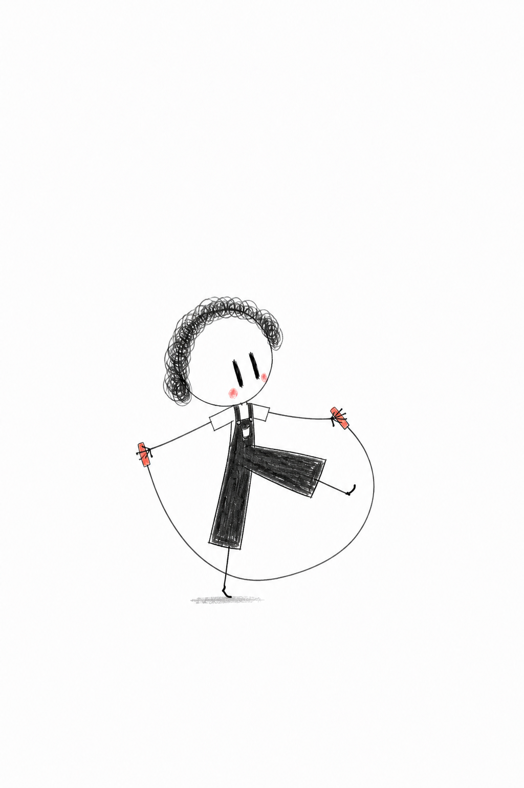
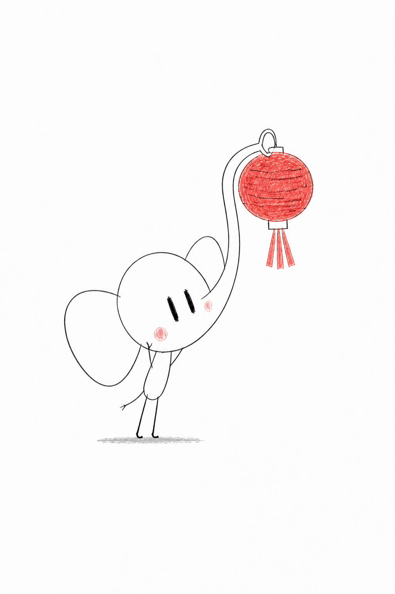
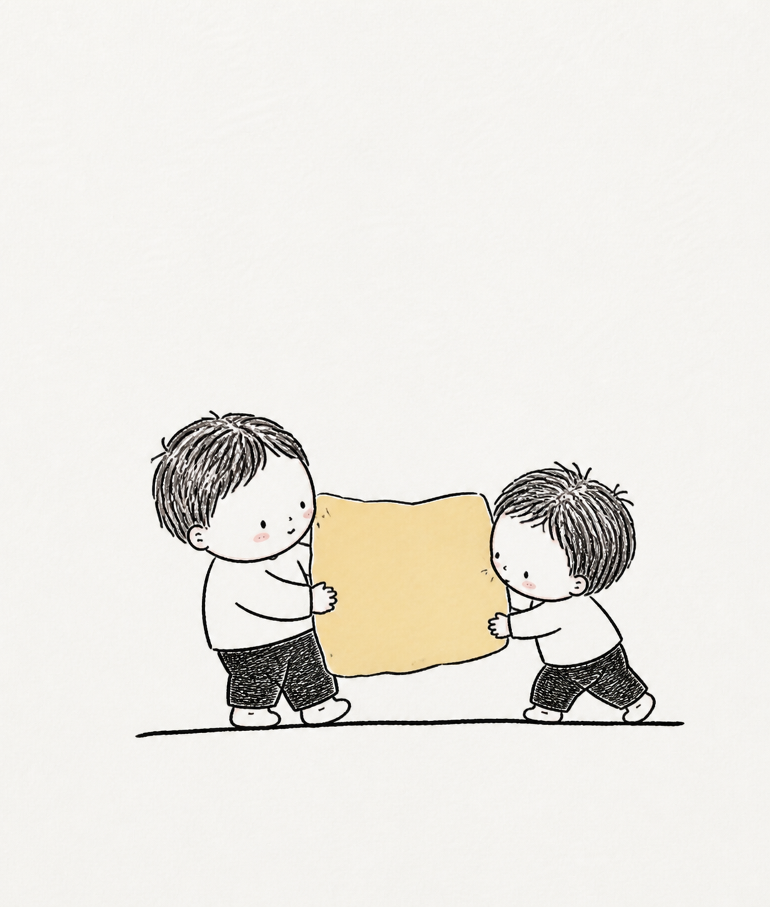
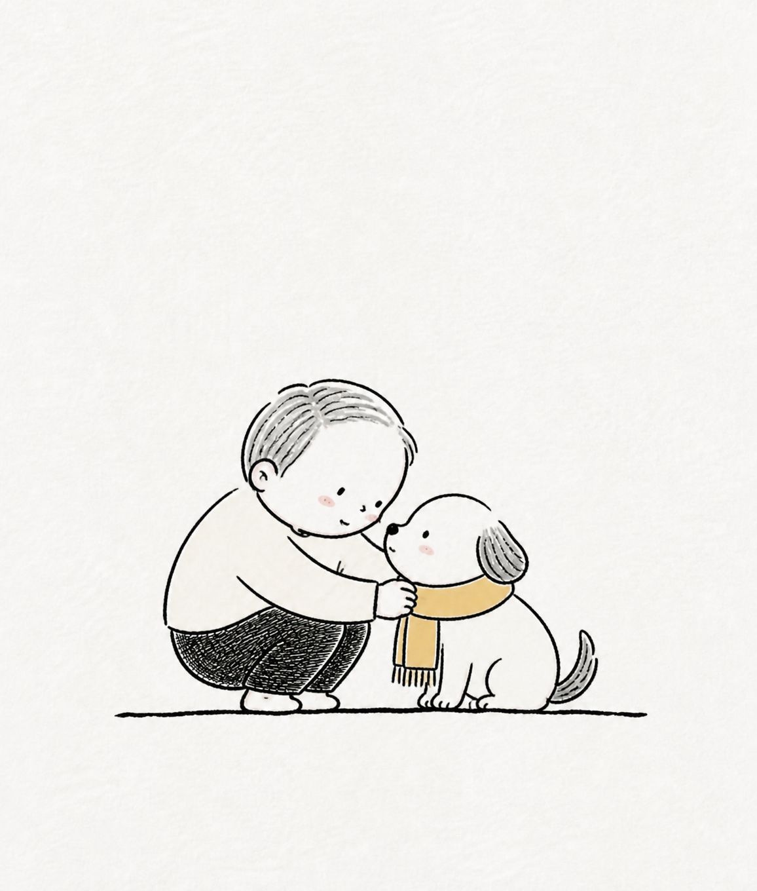
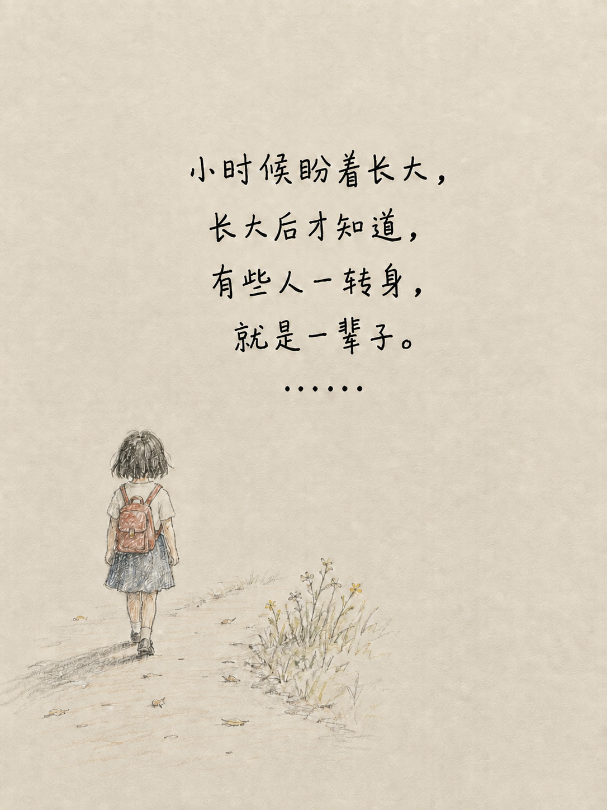
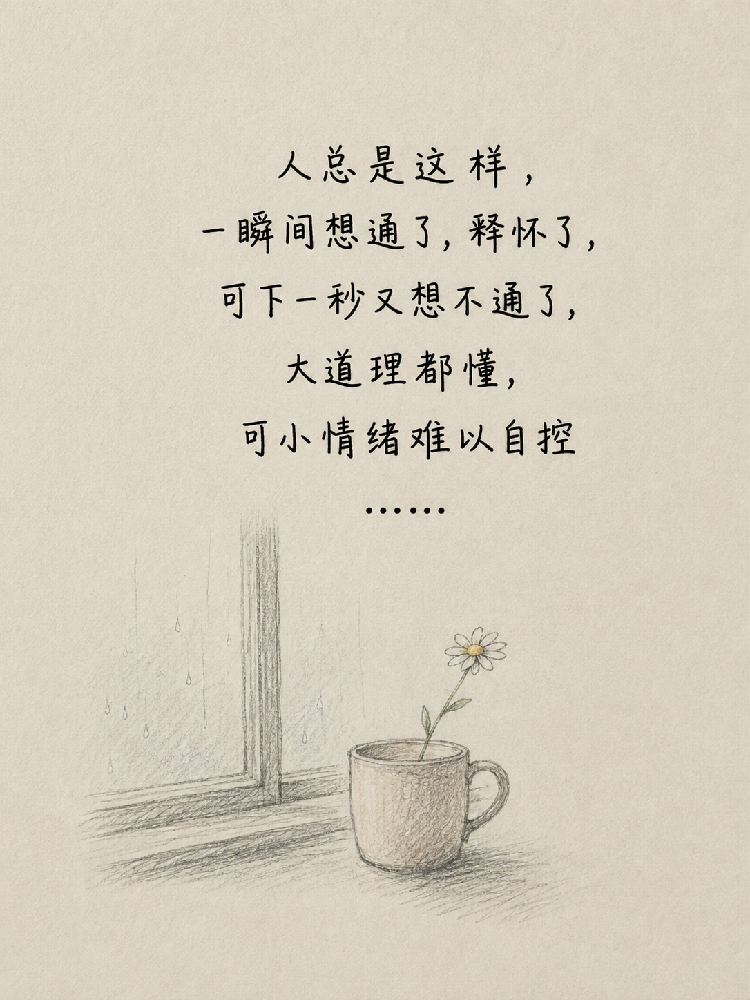
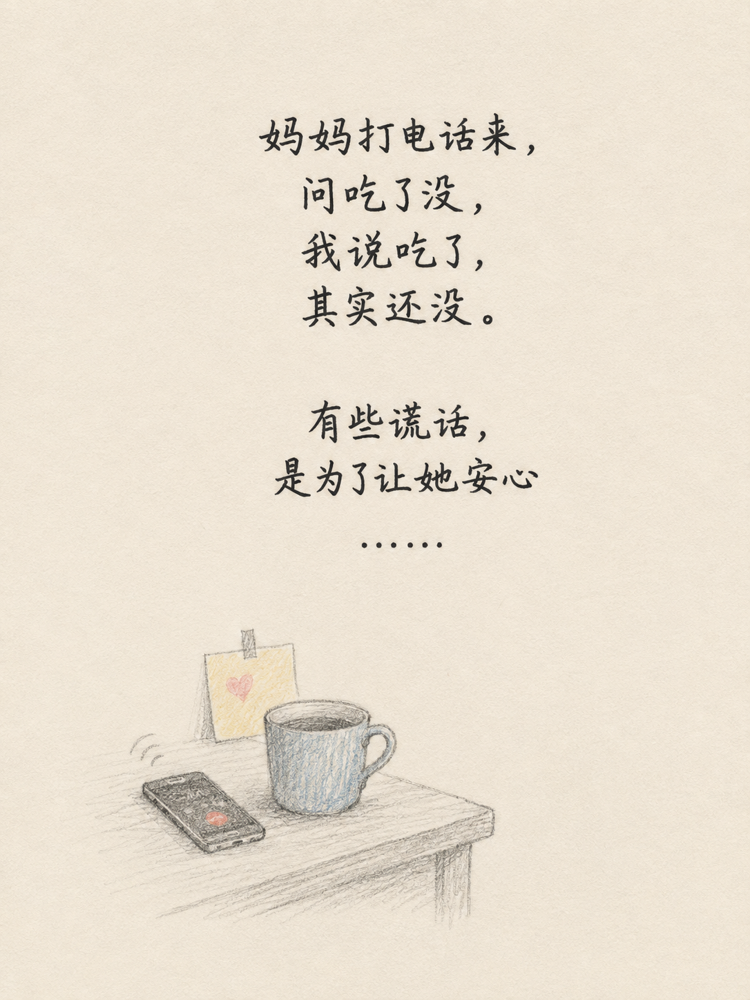

# 画风样例

这里按正式编号顺序展示样图与调用示例。完整配方只以根目录 [`STYLES.md`](../STYLES.md) 为准,避免示例页复制配方后发生漂移。

原来的 `1`、`1.1`、`1.2` 三套配方已从旧位置删除;原 `2` 起的整数配方整体前移,因此下面的 `1` 是原 `2` 重编号后的新身份。用户认可的家庭蜡笔画风迁入 `3.1 蜡笔童涂-潦草自画版`。

## 1. 极简黑白线条讲解漫画

> 输入示例:「用 1 号画风讲解番茄工作法」

## 2. 蜡笔童涂

> 输入示例:「用 2 号画风画 OCEAN 主题:小孩戴泳镜潜水、一头大鲸鱼、几条小鱼」

## 3. 吉卜力风

> 输入示例:「用 3 号画风画下雨天打伞的猫」

## 3.1 蜡笔童涂-潦草自画版

> 输入示例:「用 3.1 画爸爸把零食袋放回柜子,男孩站在旁边看着,不加文字」
>
> 正式生产、连续故事和多页作品必须把 `assets/style-3.1/anchor-family.png` 作为纯画风参考随每一张请求传入,并完整执行 `family-crayon-card-v3` 的三阶段 workflow。

## 4. 小豆人涂鸦信息图

## 5. MS Paint 烂涂鸦

## 6. 圆珠笔单线涂鸦

## 7. 蜡笔实拍

## 8. 水墨写意

## 9. 复古像素

## 10. 情绪叙事淡彩速写

## 11. 二维水彩风格

## 12. 暖光童画

## 13. 北欧纸雕

## 14. 北欧绘本水粉

## 15. 大鼻软偶

## 16. 聚光水粉立绘

## 17. 墨线绘本

## 18. 暖色扁平绘本

## 19. 圆头红线极简童画

> 输入示例:「用 19 号画风画一只幼象踮脚用鼻子提起一盏珊瑚红纸灯笼,不加文字」
>
> 正式生产必须把 `assets/style-19/anchor-roundhead-redline.png` 作为 `style-only` 参考随每张请求传入,锁定调用包指定的模型快照,并在基础生成后通过 `acceptance_contract`。基础输出是 `candidate-only`,不能直接当 final。
>
> 锚点和两张样图都保留 OpenAI C2PA/JUMBF 内容凭证。隐私工具因无法验证后重签而没有改写文件;状态是“已审计,未清理”,具体结果见各图旁的 `.privacy.json` 与 `.provenance.json`。

## 20. 暖黄墨线情绪小剧场

> 输入示例:「用 20 号画风画两个孩子一起搬一只暖黄色坐垫,不加文字」
>
> 正式生产必须把 `assets/style-20/anchor-warm-yellow-ink-story-v3.png` 作为 `style-only` 参考传入基础生成。基础图只能标为 `final-candidate`;只有机读验收器同时通过像素检查、主体内容锁、8 项评分和硬失败检查后才是 final。失败候选整张拒收并重新生成,不得用通用画风编辑修补。
>
> 锚点和两张样图都保留 OpenAI C2PA/JUMBF 内容凭证。隐私工具因无法验证后重签而没有改写文件;状态是“已审计,未清理”,具体结果见各图旁的 `.privacy.json` 与 `.provenance.json`。

## 21. 手写独白彩铅

> 输入示例:「用 21 号画风,文案:小时候盼着长大，长大后才知道，有些人一转身，就是一辈子。……」
>
> 配方只定义风格。`--text` 必填并保留空行分段;`--subject` 省略时由模型先读文案再决定内容与构图;画幅默认 3:4 可覆盖;不需要锚点。本机有 codex 时可用 `scripts/generate_monologue_card_with_codex.sh` 直接出图。三张样图都是只给文案、不给任何场景描述生成的。
>
> 样图保留 OpenAI C2PA/JUMBF 内容凭证,ExifTool 审计未发现 GPS、设备、账号或本地路径字段;状态是“已审计,未清理”,见各图旁的 `.privacy.json` 与 `.provenance.json`。
